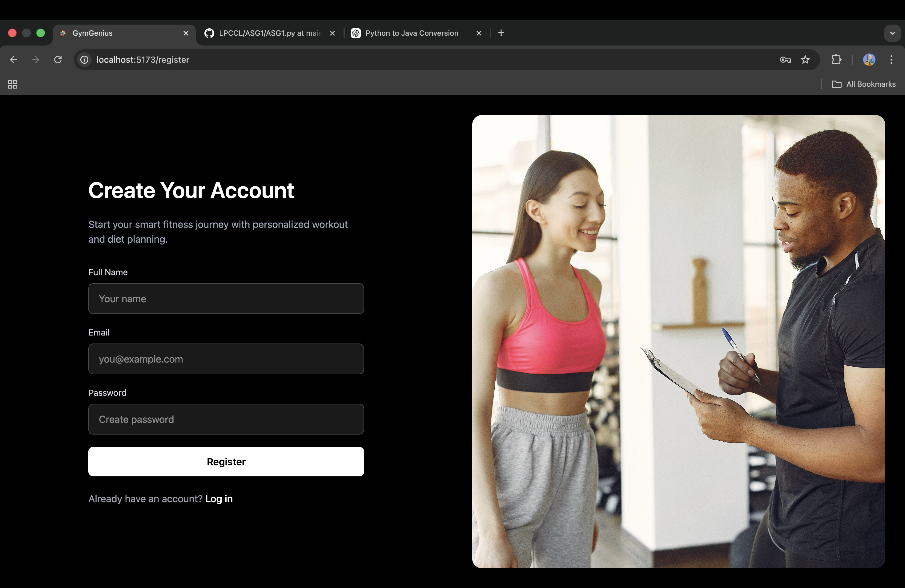
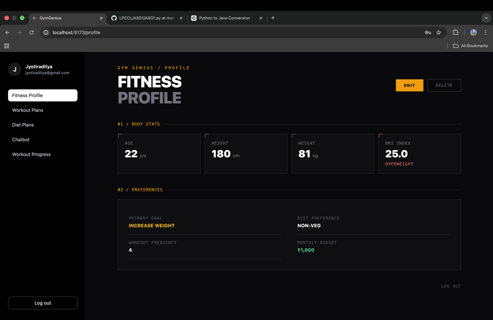
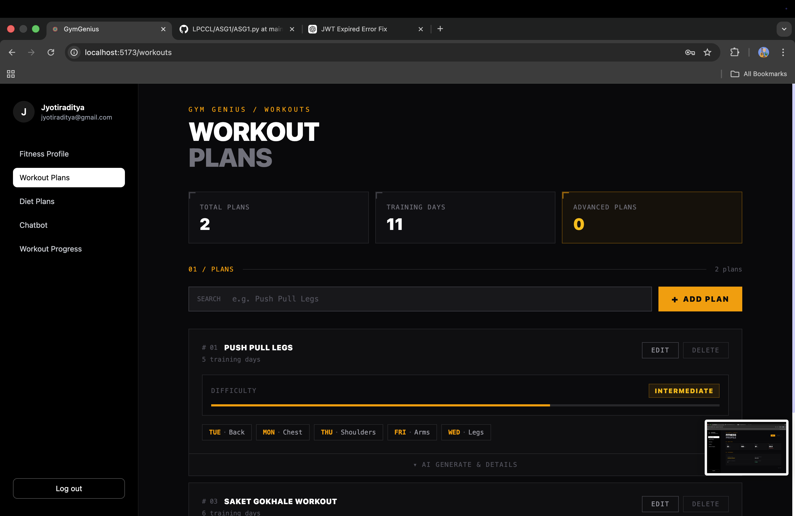
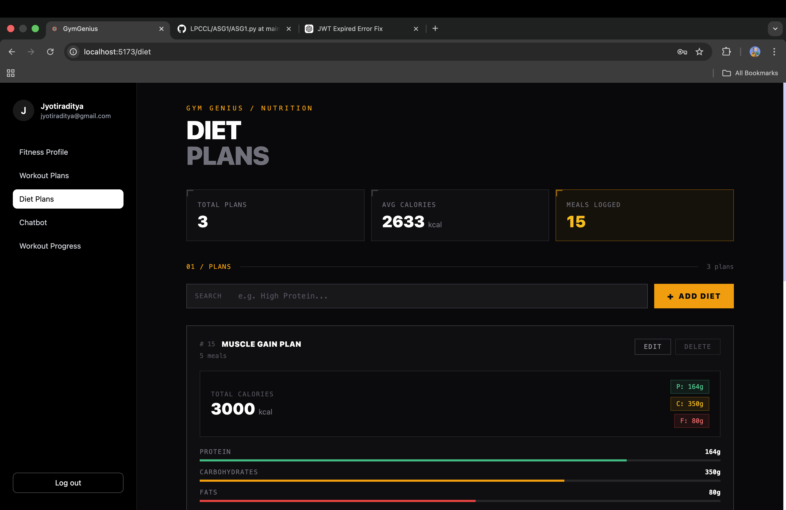
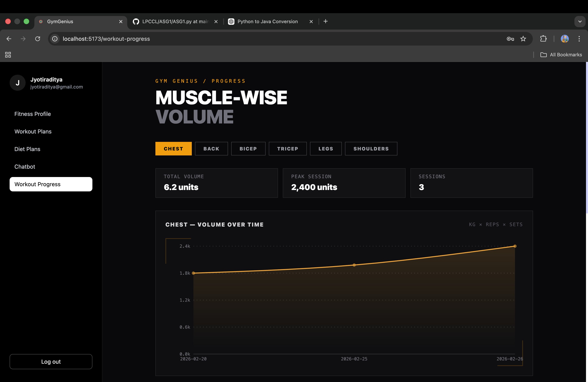

# 💪 GymGenius — Your AI-Powered Fitness Companion

<p align="center">
  
  
  
  
  
  
</p>

<p align="center">
  <b>GymGenius</b> is a full-stack AI-powered fitness web application that provides personalized workout plans, intelligent diet planning, real-time progress tracking, and a conversational gym buddy chatbot — all tailored to your fitness goals.
</p>

---

## 🧠 About

Most fitness apps hand you a generic plan and call it a day. **GymGenius is different.**

When you sign up, you build a personal fitness profile — your age, weight, height, goal, diet preference, budget, and training days. Every AI-generated feature on the platform is grounded in that profile. Your workout split, your meal plan, your chatbot answers — nothing is one-size-fits-all.

The idea is simple: **one platform, fully personalized, end-to-end.**

- Log in → build your profile → get an AI workout plan tailored to your split
- Set your macro targets → get a budget-friendly Indian meal plan with full recipes
- Track your sets, reps, and weight → visualize your volume progress over time
- Have any doubt? Ask the **AI gym buddy chatbot** — it answers like a knowledgeable training partner, not a search engine

Under the hood, React talks to a Spring Boot backend which calls a Python FastAPI microservice running **LangGraph agents** on top of the **Groq LLM API** — making every AI response fast, context-aware, and structured.

> *Built for Indian gym-goers who want smart fitness guidance without the fluff.*

---

## 🖼️ Application Screenshots

### 🔐 Authentication
<p align="center">
  
  
</p>

---

### 👤 Fitness Profile Setup
<p align="center">
  
</p>

---

### 🏋️ AI-Generated Workout Plan
<p align="center">
  
</p>

---

### 🥗 AI-Generated Diet Plan
<p align="center">
  
</p>

---

### 📊 Workout Progress Tracking
<p align="center">
  
</p>

---

## 🚀 Features

### 1. 🔐 User Authentication & Fitness Profile
Secure registration and login powered by **Spring Security (JWT)**. Once authenticated, users build their personal fitness profile:

```json
{
  "age": 22,
  "dietPreference": "Non-Veg",
  "goal": "Increase Weight",
  "height": 180.0,
  "weight": 81.0,
  "monthlyBudget": 1000,
  "workoutDays": "4"
}
```

The profile feeds directly into the AI engine to power personalized recommendations.

---

### 2. 🏋️ AI-Generated Workout Plans
Users specify their training split (e.g., Monday → Chest, Tuesday → Back) and GymGenius's AI generates a fully optimized plan based on their fitness profile.

**Example Output:**
```json
[
  {
    "planName": "Push Pull Legs",
    "difficulty": "Intermediate",
    "workoutDays": {
      "Monday": "Chest",
      "Tuesday": "Back",
      "Wednesday": "Legs",
      "Thursday": "Shoulders",
      "Friday": "Arms"
    }
  }
]
```

---

### 3. 🥗 AI-Generated Indian Diet Plans
Users input their target macros (protein, calories, fats) and GymGenius generates budget-friendly, Indian-style meal plans.

**Example Output (Muscle Gain Plan — 3000 kcal):**
```json
{
  "planName": "Muscle gain plan",
  "totalCalories": 3000,
  "protein": 164,
  "carbs": 350,
  "fats": 80,
  "meals": [
    {
      "mealName": "Breakfast",
      "mealType": "VEG",
      "calories": 700,
      "protein": 30,
      "recipe": "2 whole wheat parathas with mixed vegetables, curd and moong dal"
    },
    {
      "mealName": "Lunch",
      "mealType": "NON-VEG",
      "calories": 800,
      "protein": 50,
      "recipe": "Chicken with brown rice, mixed vegetables and dal"
    }
  ]
}
```

---

### 4. 🤖 AI Gym Buddy Chatbot
An intelligent chatbot powered by **LangGraph agents + Groq LLM** that answers questions like a knowledgeable gym buddy — whether it's exercise form, supplement advice, or recovery tips.

---

### 5. 📊 Workout Progress Tracker
Users log their exercises (name, muscle group, sets, reps, weight). GymGenius automatically computes **volume = weight × reps × sets** and renders interactive progress charts using **Recharts**.

Users can also review their last session's workout intensity per muscle group to plan progressive overload.

**Example Log Entry:**
```json
{
  "exerciseName": "Bench Press",
  "muscleGroup": "Chest",
  "sets": 4,
  "reps": 10,
  "weight": 60,
  "volume": 2400,
  "date": "2026-02-26"
}
```

---

## 🏗️ Architecture

```
┌─────────────────────────────────────────────────────────────────┐
│                        React Frontend                           │
│              (UI + Recharts Progress Visualization)             │
└───────────────────────────┬─────────────────────────────────────┘
                            │ REST API calls
                            ▼
┌─────────────────────────────────────────────────────────────────┐
│                   Spring Boot Backend                           │
│  Controllers → Services → Repositories → MySQL DB              │
│  DTOs / Entities / Spring Security (JWT Auth)                  │
└──────────────────┬──────────────────────────────────────────────┘
                   │ HTTP calls to AI Microservice
                   ▼
┌─────────────────────────────────────────────────────────────────┐
│                  FastAPI AI Microservice (Python)               │
│          LangGraph Agents → Groq LLM API                       │
│   (Workout Agent / Diet Agent / Chatbot Agent)                  │
└─────────────────────────────────────────────────────────────────┘
```

**Flow:**
1. React sends user requests to Spring Boot REST APIs.
2. Spring Boot handles auth, business logic, and DB operations.
3. For AI features, Spring Boot calls the **FastAPI microservice**.
4. FastAPI orchestrates **LangGraph agents** which call the **Groq LLM API**.
5. The AI-generated response is returned → Spring Boot maps it → React renders it.

---

## 🛠️ Tech Stack

| Layer | Technology |
|-------|-----------|
| **Frontend** | React, Recharts |
| **Backend** | Java Spring Boot, Spring Security (JWT) |
| **AI Microservice** | Python, FastAPI, LangGraph |
| **LLM Provider** | Groq API |
| **Database** | MySQL |
| **API Testing** | Postman |

---

## 📁 Project Structure

```
gymgenius/
├── frontend/                    # React Application
│   ├── src/
│   │   ├── components/          # Reusable UI Components
│   │   ├── pages/               # Page-level Components
│   │   │   ├── Auth/            # Login & Register
│   │   │   ├── Profile/         # Fitness Profile
│   │   │   ├── WorkoutPlan/     # Workout Plan Builder
│   │   │   ├── DietPlan/        # Diet Plan Generator
│   │   │   ├── Progress/        # Progress Tracker + Charts
│   │   │   └── Chatbot/         # AI Gym Buddy Chat
│   │   └── App.jsx
│
├── backend/                     # Spring Boot Application
│   └── src/main/java/
│       ├── controllers/         # REST Controllers
│       ├── services/            # Business Logic
│       ├── repositories/        # JPA Repositories
│       ├── entities/            # JPA Entities
│       ├── dto/                 # Data Transfer Objects
│       └── security/            # JWT Auth Config
│
├── ai-service/                  # Python FastAPI Microservice
│   ├── agents/
│   │   ├── workout_agent.py     # Workout Plan Agent
│   │   ├── diet_agent.py        # Diet Plan Agent
│   │   └── chatbot_agent.py     # Gym Buddy Chatbot Agent
│   ├── graphs/                  # LangGraph Definitions
│   ├── main.py                  # FastAPI App Entry Point
│   └── requirements.txt
│
└── README.md
```

---

## ⚙️ Getting Started

### Prerequisites
- Java 17+
- Node.js 18+
- Python 3.10+
- MySQL 8+
- Groq API Key

---

### 1. Clone the Repository
```bash
git clone https://github.com/yourusername/gymgenius.git
cd gymgenius
```

---

### 2. MySQL Database Setup
```sql
CREATE DATABASE gymgenius;
```
Update `backend/src/main/resources/application.properties`:
```properties
spring.datasource.url=jdbc:mysql://localhost:3306/gymgenius
spring.datasource.username=your_username
spring.datasource.password=your_password
spring.jpa.hibernate.ddl-auto=update
```

---

### 3. Spring Boot Backend
```bash
cd backend
./mvnw spring-boot:run
```
Backend runs on: `http://localhost:8080`

---

### 4. FastAPI AI Microservice
```bash
cd ai-service
pip install -r requirements.txt
```
Create a `.env` file:
```env
GROQ_API_KEY=your_groq_api_key_here
```
Start the service:
```bash
uvicorn main:app --reload --port 8000
```
AI service runs on: `http://localhost:8000`

---

### 5. React Frontend
```bash
cd frontend
npm install
npm run dev
```
Frontend runs on: `http://localhost:5173`

---

## 🔑 API Endpoints

### Auth
| Method | Endpoint | Description |
|--------|----------|-------------|
| POST | `/api/auth/register` | Register new user |
| POST | `/api/auth/login` | Login and get JWT token |

### Fitness Profile
| Method | Endpoint | Description |
|--------|----------|-------------|
| POST | `/api/profile` | Create fitness profile |
| GET | `/api/profile/{userId}` | Get user profile |
| PUT | `/api/profile/{userId}` | Update profile |

### Workout Plans
| Method | Endpoint | Description |
|--------|----------|-------------|
| POST | `/api/workout/generate` | Generate AI workout plan |
| GET | `/api/workout/{userId}` | Get all workout plans |
| DELETE | `/api/workout/{planId}` | Delete a plan |

### Diet Plans
| Method | Endpoint | Description |
|--------|----------|-------------|
| POST | `/api/diet/generate` | Generate AI diet plan |
| GET | `/api/diet/{userId}` | Get all diet plans |

### Progress Tracker
| Method | Endpoint | Description |
|--------|----------|-------------|
| POST | `/api/progress/log` | Log a workout set |
| GET | `/api/progress/{userId}` | Get all progress logs |
| GET | `/api/progress/{userId}/muscle/{group}` | Get last session by muscle group |

### Chatbot
| Method | Endpoint | Description |
|--------|----------|-------------|
| POST | `/api/chat` | Send message to gym buddy bot |

---

## 🧠 AI Agent Details (LangGraph)

GymGenius uses **LangGraph** to orchestrate multi-step AI agents:

- **Workout Agent** — Fetches the user's profile → constructs a targeted prompt → calls Groq LLM → parses and returns a structured workout plan.
- **Diet Agent** — Takes macro targets + diet preference + budget → generates a meal-by-meal Indian diet plan via Groq.
- **Chatbot Agent** — A conversational gym buddy agent with personality-tuned system prompting for fitness Q&A.

---

## 📊 Progress Visualization (Recharts)

The progress tracker uses Recharts to render:
- **Volume Over Time** — Line chart showing `weight × reps × sets` per date per exercise.
- **Muscle Group Breakdown** — Bar chart comparing volume across muscle groups.
- **Last Session Intensity** — Quick reference card for previous workout performance.

---

## 🔒 Security

- JWT-based stateless authentication via **Spring Security**.
- All endpoints (except `/api/auth/**`) are protected and require a valid Bearer token.
- Passwords are encrypted using **BCrypt**.

---

## 🧪 Testing

API testing is done using **Postman**. Import the collection:
```
gymgenius/postman/GymGenius.postman_collection.json
```

---

## 🔮 Future Enhancements

- [ ] Supplement tracker & recommendations
- [ ] Body measurement tracker (BMI, body fat %)
- [ ] Push notifications for workout reminders
- [ ] Social features — share plans with friends
- [ ] PWA support for mobile offline use
- [ ] Google OAuth login

---

## 🤝 Contributing

Pull requests are welcome! For major changes, please open an issue first.

```bash
git checkout -b feature/your-feature-name
git commit -m "feat: add your feature"
git push origin feature/your-feature-name
```

---

## 📄 License

This project is licensed under the **MIT License**.

---

<p align="center">
  Made with ❤️ and 🏋️ by the GymGenius Team
</p>
